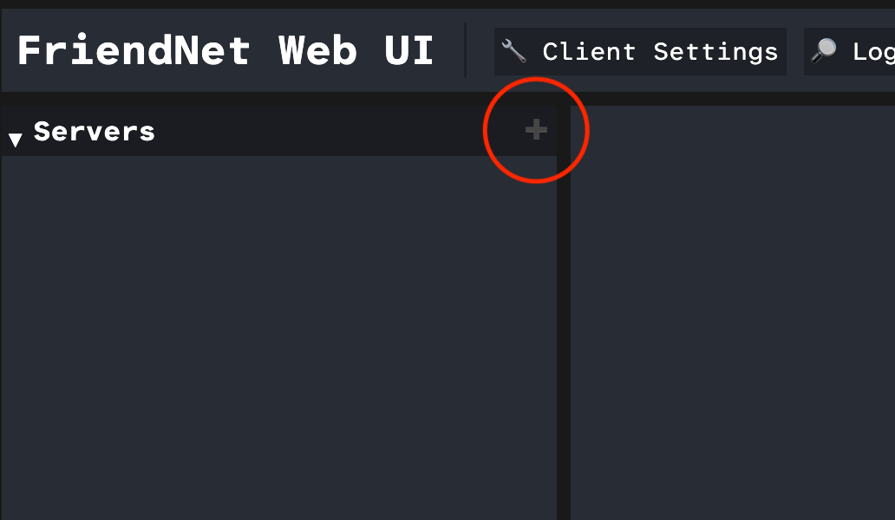
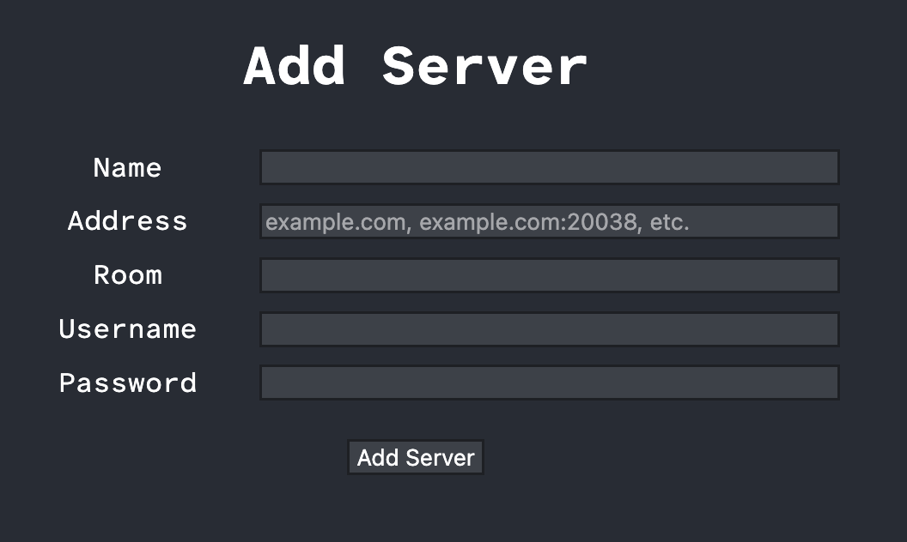
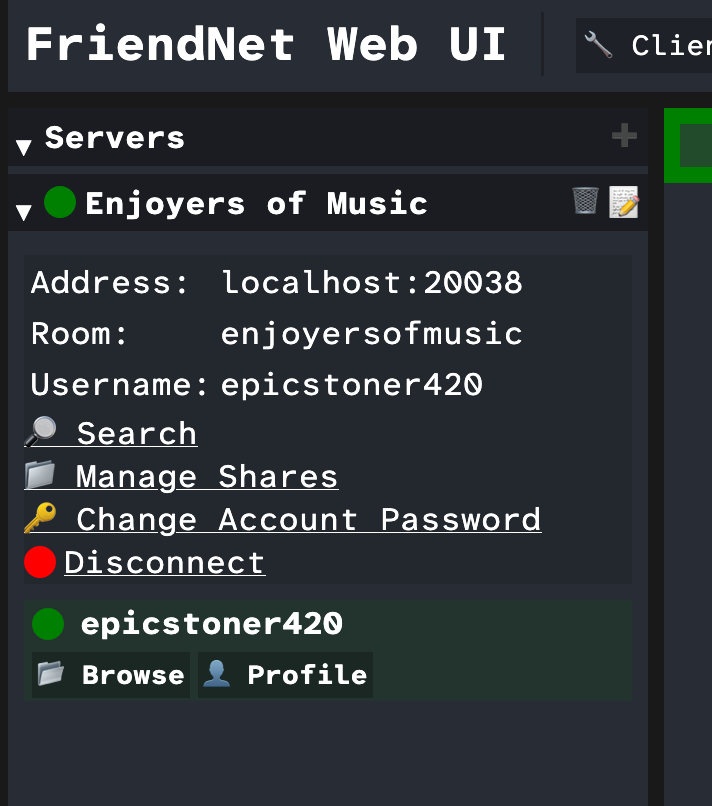

# Adding a Server

On its own, a FriendNet client can't do anything; it needs a server to find other users
and to share files with them. Your client can connect to as many server as you'd like at
once, and share different folders for each.

> Want to create your own server? Check out the [setup guide](../server/setup/index_setup.md).

To add a server, click the ➕️ icon on the `Servers` label:

From there, you will be presented with a form:

In the `Name` field, you can put whatever you want; it is the label shown only in your client.

The `Address` field is how to reach the server. It can be a domain name with a port, like
`example.com:20038`, a domain name without a port, like `example.com` (if the server's port
is the default, `20038`), or a bare IP address with or without port, depending on whether the
server is using the default port.

The `Room` field is the name of the [room](../server/rooms.md) to join.

The `Username` and `Password` fields are the credentials for the room account you are signing
in with.

Once you have filled in all the fields, click the `Add Server` field to add it.

You should see the server you just added in the server browser panel on the left:

If you made any mistakes, you can click the `📝️` icon on the server to edit it.

If you see that the server's icon is red, then the server isn't connected. To figure out why
the server is not connecting, you can click on the `🔎 Log Viewer` on the top of the client
to see recent client log messages. Search for messages like `Failed to create room connection`
and read the details under them. You may have entered the address wrong or given incorrect
credentials. You can manually reconnect by clicking `Connect` under the server once you have
corrected the mistakes.

Now that you have added your server, you can browse shares from other online users, and share
your own folders.

Next: [Managing Shares](managing-shares.md)
