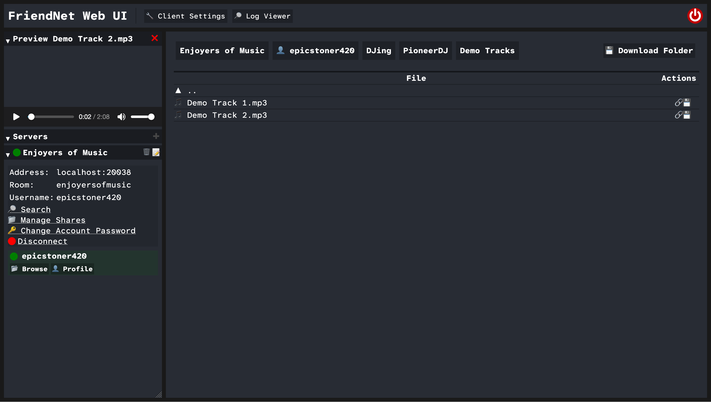

# Client

The FriendNet client is used to connect to servers and share files with other users.

It uses a web-based UI that you can access in your web browser.

Next: [Client Installation](installation/)
