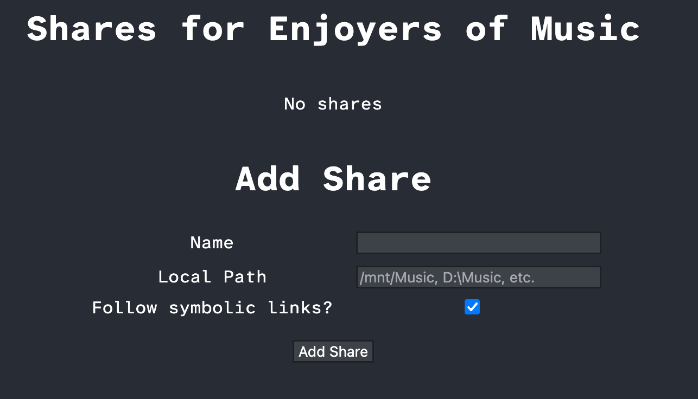
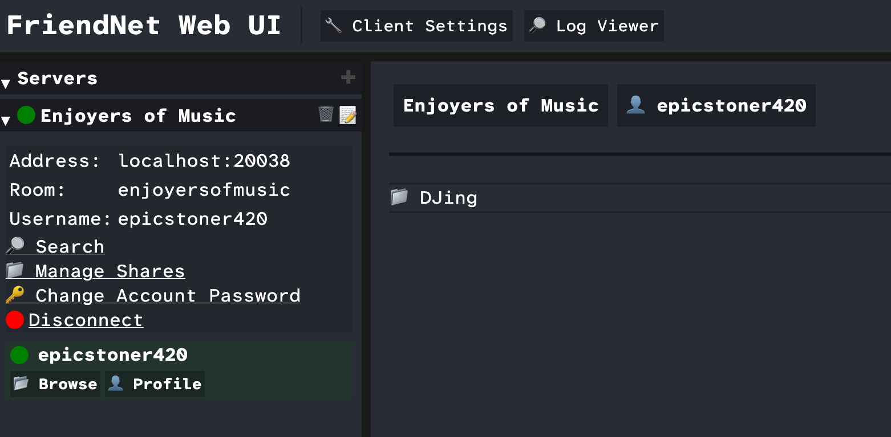

# Managing Shares

To add a share, click `📁 Manage Shares` on the server:

The `Name` field is the name to give to the share. This is the name other users will see when
browsing your shares.

The `Local Path` field is where on your computer the folder is located. It must be the absolute
path to the folder, like `C:\Users\YourUsername\Music` (on Windows),
`/Users/YourUsername/Music` (on Mac), or `/home/YourUsername/Music` (on Linux).

The `Follow symbolic links?` field determines whether the share will allow symbolic links. If you
do not know what that is, keeping it checked is the best option. If unchecked, symbolic links
will be excluded and treated as if they do not exist. This is the safest option if you know you
have symbolic links that could lead to folders you do not want shared.

Once you have added the share, any user will be able to able to browse it until you remove it.
These shares only apply to this server; you will need to configure shares separately for other
servers you are connected to.

To confirm that you have added the share, click `📂 Browse` on yourself under the server.

Congratulations! You have now shared your first folder.

Next: [Profiles](profiles.md)
