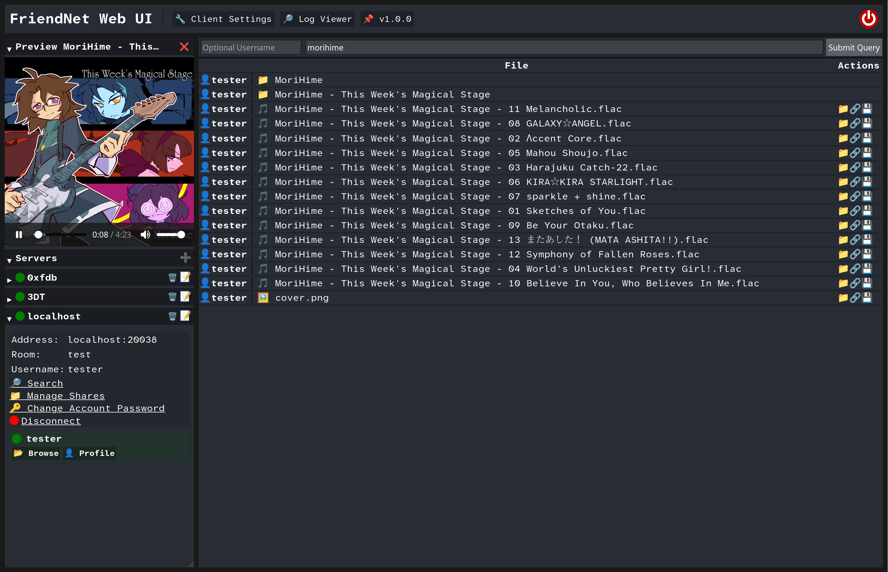

# Searching

Much like [Soulseek](https://slsknet.org), FriendNet allows searching for files and folders across all online users in
a room. To search, click on the `🔎 Search` button on the server you'd like to search in, then enter a query.

You can also specify a specific user to search. If you do, the search will be sent to that user directly and only
results from that user will be shown.

Next: [Profiles](profiles.md)
