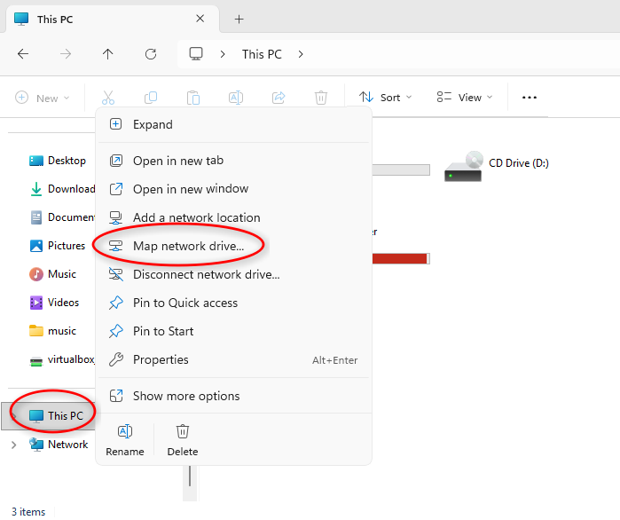
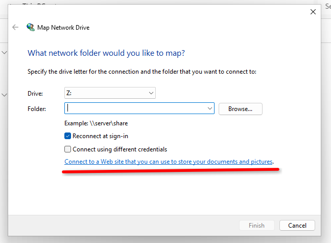
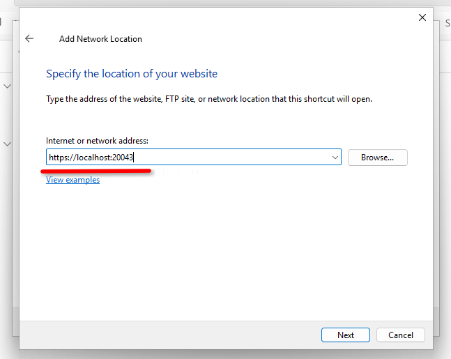
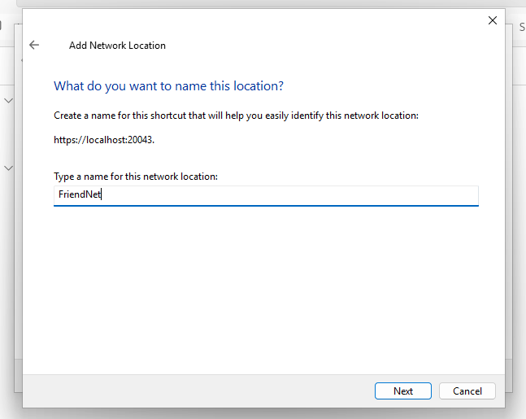

# Using with WebDAV

The FriendNet client provides a local WebDAV server for accessing files.

The server exposes a read-only virtual filesystem to browse through shares from users on all your connected servers.
This makes it possible to browse files with your system file explorer.

By default, the server runs on `davs://localhost:20043`.

# Mounting as a Network Drive on Windows

> While WebDAV is supported by Windows Explorer, it imposes a 10MB file size limit.
> The reason for this limit is unclear, but it makes copying or opening files exceeding the limit impossible
> without editing the registry.
> 
> NextCloud documented a fix for this issue [here](https://web.archive.org/web/20260312165616/https://docs.nextcloud.com/server/25/user_manual/en/files/access_webdav.html#id5).

Windows Explorer (the default file explorer) allows you to mount a WebDAV server as a virtual drive, enabling convenient access.

First, open Windows Explorer and right click `This PC`, then click `Map network drive...`.

Then click `Connect to a Web site that you can use to store your documents and pictures`.

Enter the URL of the FriendNet server, using `https://`, *not* `davs://`.

Enter a name for the share.

Once you confirm the connection, you will be able to browse the files in all your connected servers from Windows Explorer.

# Using with Linux

Depending on your distro, connecting to a WebDAV server looks a little different.

If you use Dolphin (installed if you use KDE), Thunar or PCManFM, you can simply type `davs://localhost:20043` into the address bar.

You may need `gvfs` or `davfs2` installed if it does not work out of the box with your file manager.

For more guidance on mounting a WebDAV server on Linux, check out the `Client` section in the ArchWiki [WebDAV article](https://wiki.archlinux.org/title/WebDAV).

Many Linux WebDAV clients are slow, so be patient on the first load.
WebDAV is a generally inefficient protocol for browsing files, despite its popularity.

---

Next: [Yggdrasil Support](yggdrasil-support.md)
