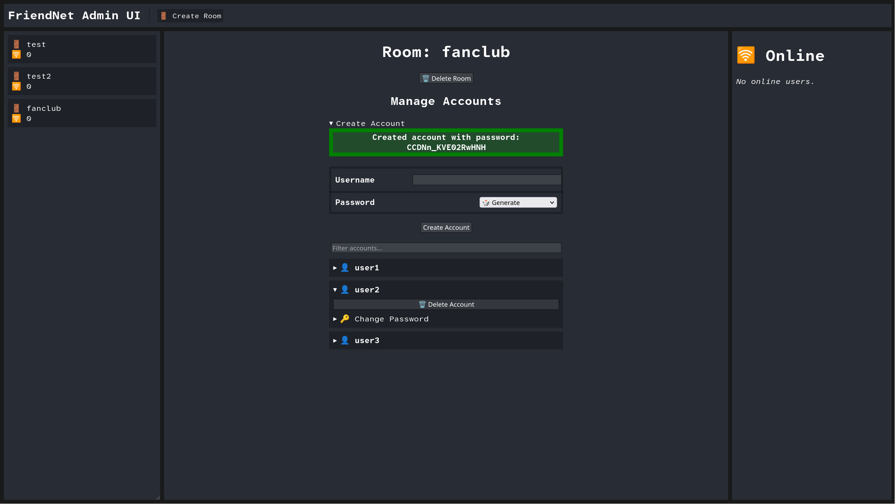

# Management

If your server is not yet running, start it.

The server can be managed in the following ways:
 - Using the built-in CLI while it is running
 - The separate RPC client remotely
 - The admin UI

When the server is running, its CLI will be accessible through the terminal.
You can type `help` to see a list of commands.

Some useful commands to set up a new server:

- `createroom` Create a new room
- `createaccount` Create an account for a room

The usage for each command is documented in the CLI.

## RPC Client

To manage the server remotely or without having to touch its CLI, you can use the RPC client. It works the same way as
the CLI, but can be used to manage the server remotely.

The RPC client binary is packaged with the server and named `rpcclient`. To use it, you can call it in the same
directory where the server's management socket is located (usually the server's current working directory), or specify
it manually using the `-addr` flag.

The `-addr` flag can be used to specify the address of the RPC interface
(`unix:///path/to/socket`, `http://127.0.0.1:8080`, etc.). It can be a UNIX socket path, or an HTTP or HTTPS URL.

If the interface requires a bearer token, use the `-token` flag to specify it.

RPC interfaces can be configured in the server's `server.json` file.

## Admin UI

The admin UI is a web management interface for the server.



To enable it, you will need to add an RPC interface to your config JSON:

```json
{
    "address": "https://127.0.0.1:9999",
    "allowed_methods": [
        "*"
    ],
    "bearer_token": "A_SECRET_LONG_RANDOM_STRING",
    "enable_admin_ui": true
}
```

Change the bearer token to a long random string; it is equivalent to a password.

You can change the address to wherever you want the admin UI to be accessible.
The address can be HTTPS or HTTP. It uses a self-signed certificate by default if you use HTTPS.

When you start the server, it will print a message like `admin UI listening` with the URL to access the admin UI.

It is recommended to run the interface behind a reverse proxy like Nginx if you want to remotely access it.
