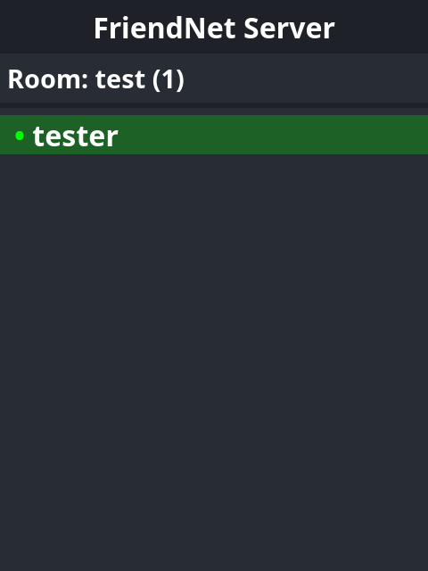

# Widget

If you want to show the status of your server and online room users on a webpage, you can use the
`friendnet-server-widget` web component on your website.

To include the widget code, add the following HTML to your page:

```html
<script type="module" async defer src="https://cdn.jsdelivr.net/npm/friendnet-server-widget@latest/dist/friendnet-server-widget.js"></script>
```

If you use NPM, you can install it with:

```shell
npm install friendnet-server-widget
```

Then, include the component in your HTML:

```html
<friendnet-server-widget
	rpc="http://localhost:8080"
	room="roomname"
	label="My Friend Group Server (can be empty)"
	token="set token if needed"
/>
```

Replace `http://localhost:8080` with the URL of your FriendNet's public RPC interface.

Your RPC interface must support at least the following methods:

- `GetRoomInfo`
- `GetOnlineUsers`

Remember that publicly exposing other methods, especially action/update methods, is dangerous.

You should now have a widget for your server!

> 

## Serving the RPC Endpoint over HTTPS

For the widget to work the best, you should put the server RPC endpoint behind a reverse proxy like
[Nginx](https://nginx.org/) or [Caddy](https://caddyserver.com/) to provide HTTPS support.
The server does not provide HTTPS capabilities for the RPC endpoint itself.

Make sure to enable HTTP/2 support for the endpoint. Without it, updating the widget may be slow and unreliable.
This is because the RPC endpoint depends on gRPC-Web, an extension to the HTTP/2-dependent protocol
[gRPC](https://grpc.io/).
