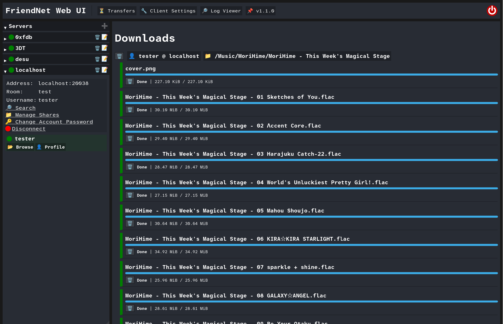

# FriendNet's Download Manager

FriendNet v1.1.0 was just [released](/download), adding a fully-featured download manager.

The download manager (located in the `⏳ Transfers` tab) replaces the old method of doing bulk downloads.
Previously, the `Download Folder` button would generate a zip file for the folder's contents., and the download
buttons on individual files would just download them in the browser.

The old way of downloading worked, but it was not meant to be the final version. If you closed your browser,
had a connection issue, or the peer disconnected, your progress would be lost. It also didn't give users running
the client headless on a home server or similar a way of downloading to the server itself.

The download manager is resumable and resilient to connection issues by design, and heavily influenced by
[Nicotine+](https://nicotine-plus.org/)'s download manager. A peer disconnected? No problem, the download will
resume when the peer reconnects. Your Internet went out? The download will resume where it left off when your
PC is back online.

One of the most important features of the download manager is the ability to bulk download folders concurrently.
You can change your client's download concurrency setting on the fly, controlling how many files to download at
once. This is especially useful for downloading folders with many small- or medium-sized files

In addition to this, there are more features and improvements planned in the future.

Enjoy!
